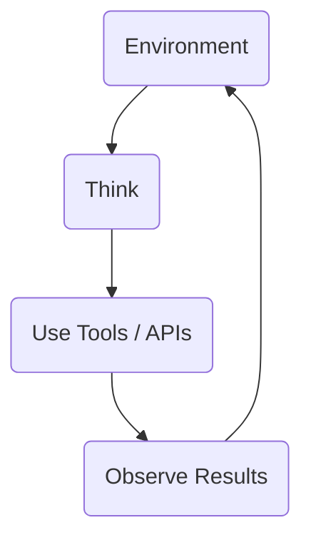

# 🚀 Modern AI Roadmap

A structured collection of study notes covering the core concepts of **Modern Artificial Intelligence**, **Large Language Models (LLMs)**, **AI Agents**, **Retrieval-Augmented Generation (RAG)**, **Vector Databases**, **Model Context Protocol (MCP)**, **Multi-Agent Systems (MAS)**, and modern AI engineering practices.

> **Purpose:** This repository serves as a personal learning resource and quick revision guide while exploring modern AI concepts and architectures.

---

## 📖 Table of Contents

* [Who Is This Repository For?](#-who-is-this-repository-for)
* [Prerequisites](#-prerequisites)
* [1. Foundational Evolution: From Rules to Transformers](#1-foundational-evolution-from-rules-to-transformers)
* [2. The LLM Engine: Core Mechanics](#2-the-llm-engine-core-mechanics)
* [3. The Agentic Revolution: Beyond Chatbots](#3-the-agentic-revolution-beyond-chatbots)
* [4. Extending Capability: Tools and Memory](#4-extending-capability-tools-and-memory)
* [5. Private Data Integration: RAG and Vector Databases](#5-private-data-integration-rag-and-vector-databases)
* [6. Interoperability and Communication Protocols](#6-interoperability-and-communication-protocols)
* [7. Smart Agent Architectures](#7-smart-agent-architectures)
* [8. Operational Governance: Safety and Cost](#8-operational-governance-safety-and-cost)
* [9. Developer Roadmap](#9-developer-roadmap)
* [Key Takeaways](#-key-takeaways)
* [Recommended Next Topics](#-recommended-next-topics)
* [Contributing](#-contributing)

---

## 🎯 Who Is This Repository For?

This repository is intended for:

* Students learning AI
* Software Developers
* Data Engineers
* AI Engineers
* Machine Learning Enthusiasts
* Anyone who wants a structured overview of modern AI concepts

---

## 📌 Prerequisites

Having a basic understanding of the following topics will make these notes easier to follow:

* Python
* APIs
* Basic Machine Learning concepts
* Git & GitHub (optional)

---

# 1. Foundational Evolution: From Rules to Transformers

The transition from traditional software to modern AI marks a shift from rigid, developer-defined logic to dynamic, data-driven pattern recognition.

## Contrasting Software Paradigms

| Feature     | Rules-Based Software                                       | Machine Learning                          |
| ----------- | ---------------------------------------------------------- | ----------------------------------------- |
| Logic       | Strict `if/else` conditions manually defined by developers | Learns patterns and predictions from data |
| Training    | Not required                                               | Typically uses an 80/20 train-test split  |
| Maintenance | Requires manual code updates                               | Requires retraining using new datasets    |

## The Transformer Breakthrough (2017)

The research paper **"Attention Is All You Need" (2017)** introduced the Transformer architecture and fundamentally changed **Natural Language Processing (NLP)**.

Unlike previous models that processed text sequentially, Transformers analyze entire sequences simultaneously using the **Attention Mechanism**, enabling significantly better contextual understanding.

## Applied AI: The 40-Year Gap

Modern AI is not based on brand-new mathematics.

Many concepts behind neural networks have existed for decades. The recent AI revolution became possible because modern GPUs, cloud computing, and massive datasets finally made large-scale training practical.

## Open Source vs Open Weight

These terms are often confused.

* **Open Source**

  * Training code
  * Training datasets
  * Model architecture
  * Everything is publicly available.

* **Open Weight**

  * Only the trained model weights are released.
  * Training data and methodology remain private.

---

# 2. The LLM Engine: Core Mechanics

Large Language Models (LLMs) work primarily through **Next Token Prediction**.

Instead of memorizing answers, they continuously predict the most probable next token based on probability.

## Tokens

A token is the smallest unit processed by an LLM.

A token is roughly equivalent to **70% of a common English word**, although this varies depending on the tokenizer.

## Why GPUs Matter

LLMs perform trillions of matrix multiplications.

GPUs provide highly parallel computation, while high-bandwidth memory keeps model weights readily available for efficient inference.

## Temperature

Temperature controls randomness.

### Low Temperature

* More deterministic
* More factual
* Better for coding and technical work

### High Temperature

* More creative
* Less predictable
* Better for brainstorming and storytelling

## Context Window

The Context Window determines how much previous information the model can access during a conversation.

Although modern models advertise million-token context windows, extremely large contexts may reduce reasoning quality and increase hallucinations.

---

# 3. The Agentic Revolution: Beyond Chatbots

AI is evolving from reactive chatbots toward autonomous AI Agents.

## Chatbots

* Respond to prompts
* Limited to conversations
* Require manual interaction

## AI Agents

Agents can:

* Plan tasks
* Call APIs
* Use external tools
* Make decisions
* Continue working autonomously toward goals

## Core Agent Loop

The loop continues until the goal is completed.

## ReAct Pattern (Reasoning + Acting)

ReAct encourages an agent to reason before acting.

Instead of immediately using a tool, the model first explains its reasoning, improving transparency and reliability.

---

# 4. Extending Capability: Tools and Memory

## Tools: The Bridge to Determinism

An LLM alone cannot access:

* Live weather
* Stock prices
* SQL databases
* Company documents
* Current time

Tools bridge this gap.

The LLM decides **when** to call a tool, while deterministic code performs the actual operation.

Examples include:

* Weather APIs
* Currency converters
* SQL queries
* Slack
* WhatsApp
* Google Drive

## The Memory Problem

Standard API calls are **stateless**.

Every request begins with no memory unless additional memory systems are implemented.

### Long-Term Memory

Persistent information stored in databases.

### Working Memory

The current conversation stored inside the Context Window.

### Episodic Memory

Remembering previous workflows or completed tasks during long-running processes.

---

# 5. Private Data Integration: RAG and Vector Databases

Retrieval-Augmented Generation (RAG) enables LLMs to answer questions using private company knowledge without retraining the model.

## Popular Vector Databases

* Pinecone
* Qdrant
* Weaviate
* Chroma

## How It Works

Documents are converted into numerical vectors called **embeddings**.

Instead of searching for exact keywords, vector databases compare embeddings using similarity measures such as:

* Cosine Similarity
* Dot Product
* Euclidean Distance

This enables **semantic search**, where documents are retrieved based on meaning rather than exact wording.

Example:

* Zomato
* Swiggy

Although these words are different, they appear close together in vector space because both represent food delivery services.

---

# 6. Interoperability and Communication Protocols

## Model Context Protocol (MCP)

Developed by Anthropic, MCP standardizes communication between AI models and external applications.

Think of MCP as the **USB-C of AI integrations**.

Instead of building custom integrations for every application, developers can rely on one standardized protocol.

## Agent-to-Agent (A2A)

A2A protocols allow multiple AI agents to communicate and collaborate.

While several standards are emerging, MCP currently has the strongest industry adoption for connecting AI models with external tools.

---

# 7. Smart Agent Architectures

## Chain of Thought (CoT)

Encourages models to solve problems using step-by-step reasoning.

## Plan & Execute

The model first creates a plan before executing actions.

This improves reliability for complex workflows.

## Evaluation (Evals)

A secondary evaluator verifies whether the generated output satisfies the original objective.

## Multi-Agent Systems (MAS)

Rather than relying on one agent, multiple specialized agents collaborate.

Example architecture:

* 👨‍💼 Manager Agent
* 🌐 Web Search Agent
* 💻 Coding Agent
* 🗄 Database Agent
* 📁 File Agent

## Cost Warning

Multi-Agent Systems consume significantly more tokens because multiple agents communicate and reason simultaneously.

Poorly designed systems can become expensive very quickly.

---

# 8. Operational Governance: Safety and Cost

## Guardrails

Guardrails improve AI safety by validating both user inputs and model outputs.

### Input Guardrails

* Detect prompt injection
* Detect jailbreak attempts
* Block malicious prompts

### Output Guardrails

* Remove harmful responses
* Reduce hallucinations
* Protect sensitive information

### Human in the Loop (HITL)

High-risk actions require human approval before execution.

Examples include:

* Deleting databases
* Sending bulk emails
* Financial transactions

## The 60 / 30 / 10 Strategy

Deploy different model sizes depending on task complexity.

### 60%

Small or local models.

Examples:

* Llama
* Mistral
* Flash / Mini models

### 30%

Mid-sized reasoning models.

### 10%

Large frontier models for planning and evaluation.

Examples:

* GPT
* Claude
* Gemini

---

# 9. Developer Roadmap

A practical roadmap for learning AI Engineering:

* ✅ Build simple chatbots
* ✅ Learn API integration
* ✅ Add deterministic tools
* ✅ Implement memory
* ✅ Build RAG systems
* ✅ Learn Vector Databases
* ✅ Explore MCP
* ✅ Build AI Agents
* ✅ Design Multi-Agent Systems
* ✅ Learn orchestration frameworks such as LangChain and LangGraph

---

# 🎯 Key Takeaways

Modern AI extends far beyond prompt engineering.

Understanding:

* LLMs
* AI Agents
* Memory
* Tools
* RAG
* Vector Databases
* MCP
* Multi-Agent Systems
* Guardrails

provides the foundation required to build modern AI applications and intelligent automation systems.

---

## 📚 Recommended Next Topics

After completing these notes, consider learning:

* Prompt Engineering
* Function Calling
* AI Automation
* AI Workflows
* LangGraph
* LangChain
* CrewAI
* AutoGen
* Fine-Tuning
* Model Serving
* AI Evaluation (Evals)

---

## 🤝 Contributing

Suggestions, corrections, and improvements are always welcome.

If you find an error or would like to improve these notes, feel free to open an Issue or submit a Pull Request.
